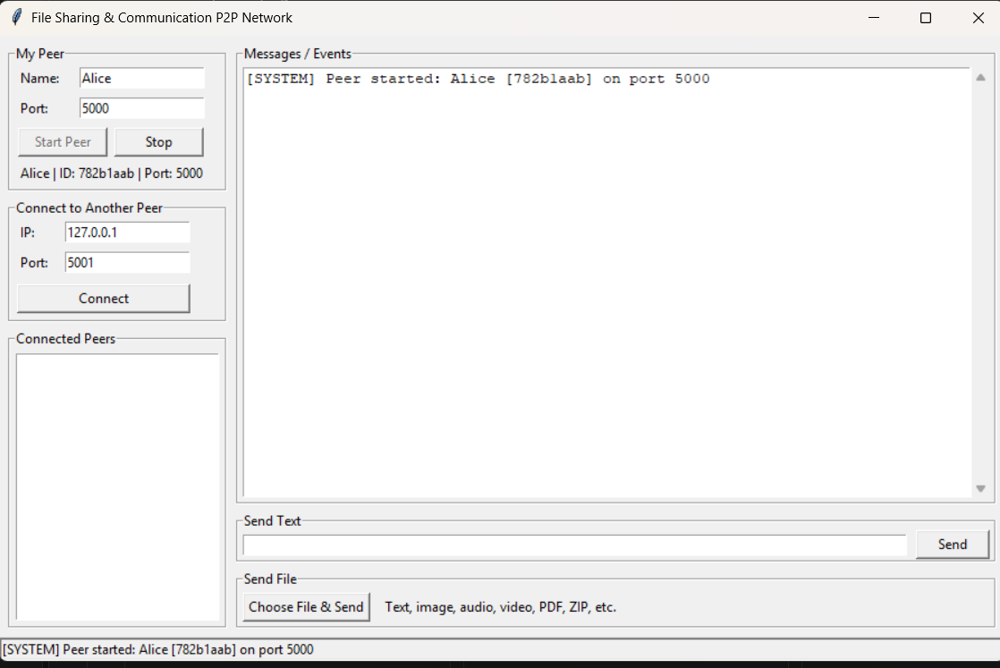
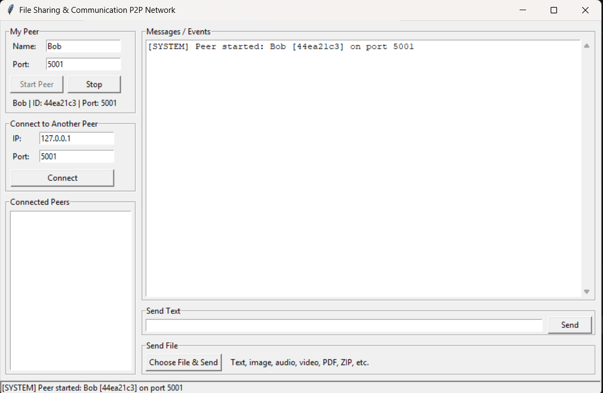
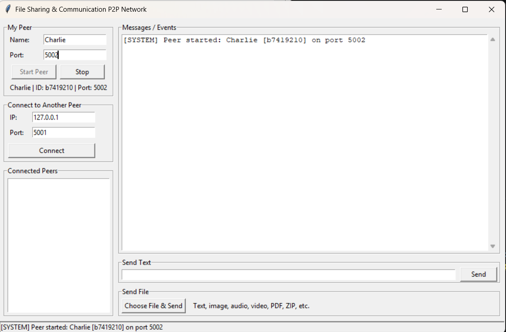
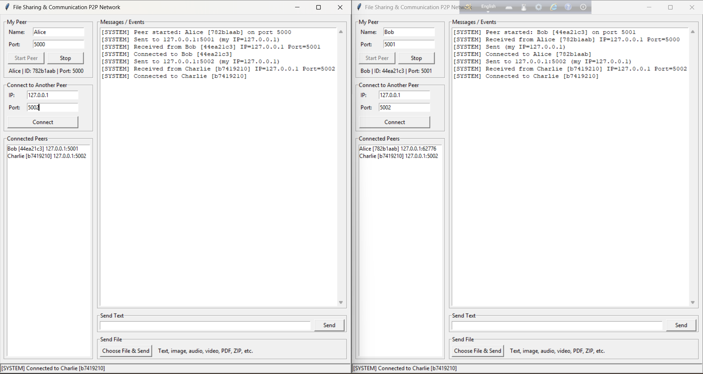
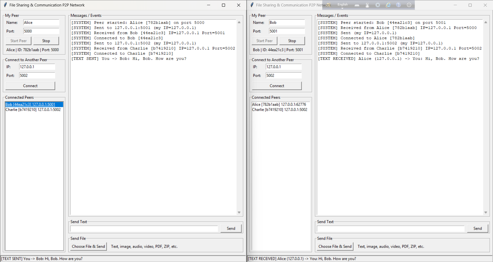
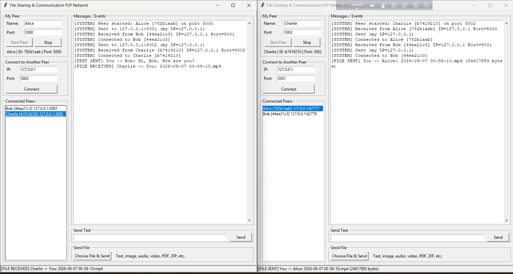
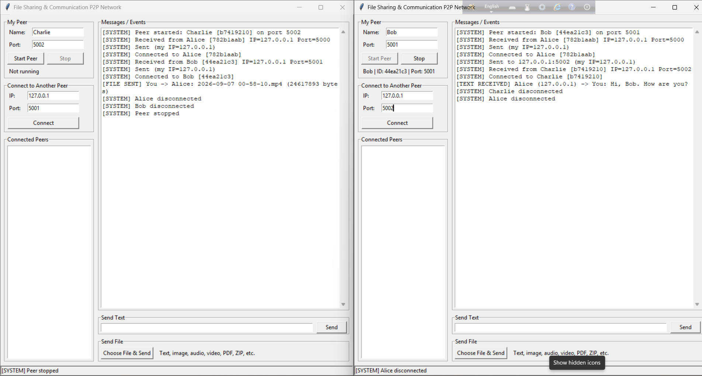
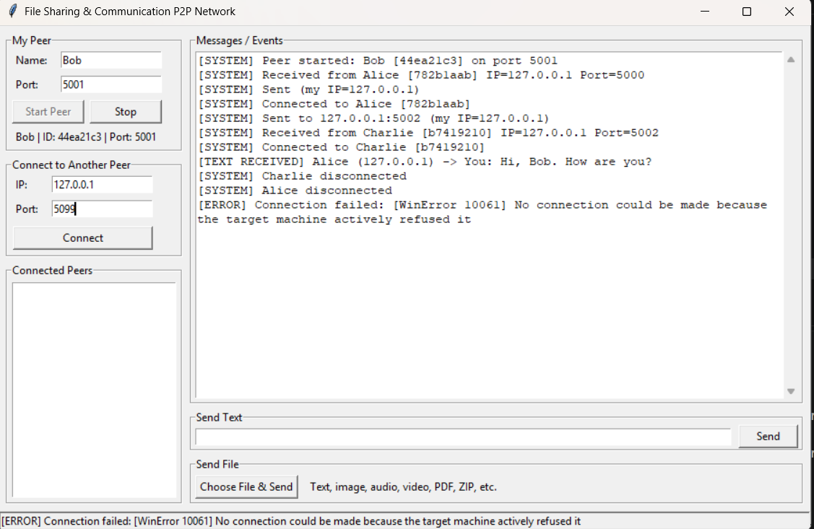
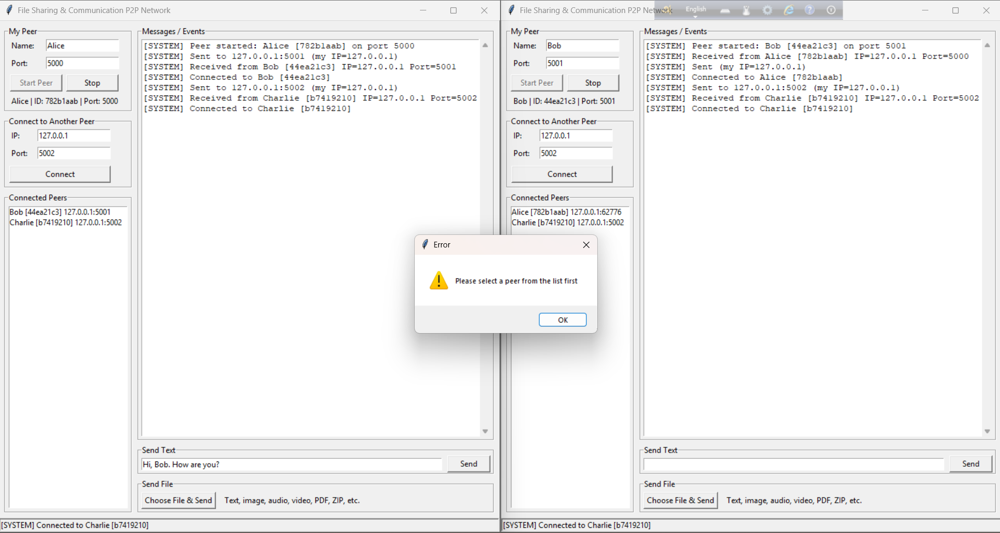

# P2P Network — Text Messaging & File Sharing

## 1. Project Description

A lightweight peer-to-peer network built with Python TCP sockets. Every running instance is one **peer** that works as both a **TCP server** (accepts incoming connections) and a **TCP client** (connects to other peers). There is no central server: peers exchange text messages and files directly.

Features:
- Start a peer with a name and a listening port
- Connect to another peer using IP + port (HELLO handshake)
- Connected peer list
- Send text messages to a selected peer
- Send any binary file (text, image, audio, video, PDF, ZIP, ...) in 64 KB chunks
- Multiple simultaneous peers (one thread per connection)
- Basic error handling (invalid IP/port, connection refused, peer disconnect, missing file)
- Simple Tkinter GUI

## 2. Requirements

- Python 3.9 or later
- Windows / Linux / macOS
- Only the standard library is used (`socket`, `threading`, `struct`, `json`, `tkinter`, ...). No `pip install` needed.
- On some Linux systems Tkinter must be installed: `sudo apt install python3-tk`

## 3. Project Structure

```
P2P_Network/
|-- main.py           # Tkinter GUI and user interaction
|-- p2p_node.py       # Peer networking: server, client, threads, text, file transfer
|-- protocol.py       # Message framing (4-byte length + JSON) and message builders
|-- requirements.txt  # (no third-party packages)
|-- README.md
|-- downloads/        # Received files are saved here
|-- screenshots/      # Screenshots used in this README
```

## 4. How to Run

```bash
python main.py
```

Run it once per peer (open a separate terminal for each peer on the same computer).

## 5. How to Connect Two Peers

**Same computer**
1. Terminal 1: `python main.py` → Name `Alice`, Port `5000` → **Start Peer**
2. Terminal 2: `python main.py` → Name `Bob`, Port `5001` → **Start Peer**
3. In Bob's window: IP `127.0.0.1`, Port `5000` → **Connect**
4. Both windows now show each other in the *Connected Peers* list.

**Two computers (same Wi-Fi/LAN)**
1. On Computer A find the IP (`ipconfig` on Windows, `ip a` / `ifconfig` on Linux/macOS), e.g. `192.168.1.10`.
2. Start peer A on port `5000`.
3. On Computer B start a peer, then connect to `192.168.1.10` : `5000`.
4. If the connection fails, allow Python through the firewall for private networks.

**Multiple peers:** start Charlie on port `5002` and connect to Alice and/or Bob. Peers can be connected in any pattern.

## 6. How to Send Messages and Files

- **Text:** select a peer in the *Connected Peers* list → type in *Send Text* → press **Send** (or Enter).
- **File:** select a peer → click **Choose File & Send** → pick any file. The receiver stores it in `downloads/` (if the name exists, `_1`, `_2`, ... is added instead of overwriting).

## 7. How It Works

```
IP + Port → TCP Socket → HELLO Handshake → Application Protocol → Text / File Data
```

**Handshake:** the connecting peer sends `hello`; the other peer replies `hello_ack`. Both sides learn each other's `peer_id` and name.

**Message framing:** TCP is a byte stream, so each message is sent as
`[4-byte length][JSON payload]`. The receiver reads exactly 4 bytes, then exactly that many bytes (`recv_exact`).

**Message types:** `hello`, `hello_ack`, `text`, `file`.

**File transfer:**
1. Sender sends a `file` JSON message with `filename` and `filesize`.
2. Sender sends the raw bytes in 64 KB chunks with `sendall()`.
3. Receiver reads exactly `filesize` bytes and writes them to `downloads/`.

Since the file is treated as plain binary data, one protocol works for every file type.

**Threads:** one thread accepts connections, and each connected peer has its own listener thread. A per-peer send lock prevents text and file bytes from mixing. The GUI is updated only from the main thread through a queue.

## 8. Error Handling

Handled without crashing: invalid IP, invalid port, connection refused/timeout, connecting to yourself, duplicate connection, peer disconnect (removed from list), missing file, invalid file size, sending without selecting a peer or starting the peer, port already in use. The file name of received files is sanitized with `os.path.basename` to prevent path traversal.

## 9. Testing Done

| Test | Result |
|------|--------|
| Two peers on same computer (text, image, audio, video) | Pass |
| Two computers on same LAN |  not tested |
| Three peers (Alice–Bob, Bob–Charlie, Charlie–Alice) | Pass |
| Peer disconnect handling | Pass |

## 10. Screenshots

**Peer 1 (Alice, port 5000)**


**Peer 2 (Bob, port 5001)**


**Peer 3 (Charlie, port 5002)**


**Connected peer list**


**Text messaging**


**File transfer (sending and received file in downloads/)**


**Disconnected**


**Error Handling – Connection Refused**


**Error Handling – Text/File Error(receiver is not selected)**


## 11. Limitations

No encryption, authentication, NAT traversal, or peer discovery. Peers must know each other's IP and port. This is an educational project focused on TCP sockets, threads, framing and file transfer.
